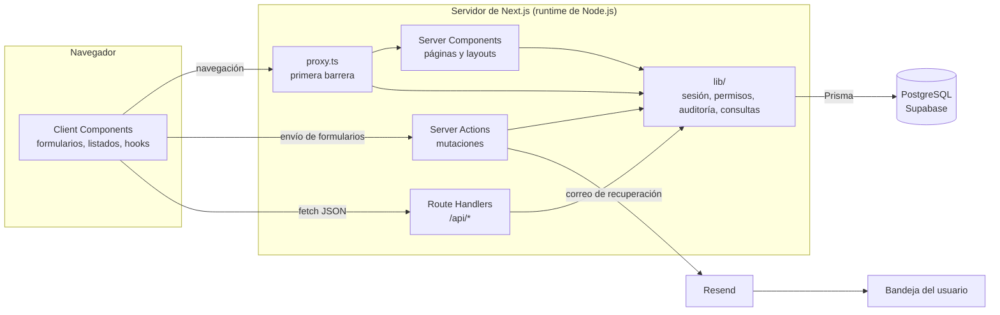
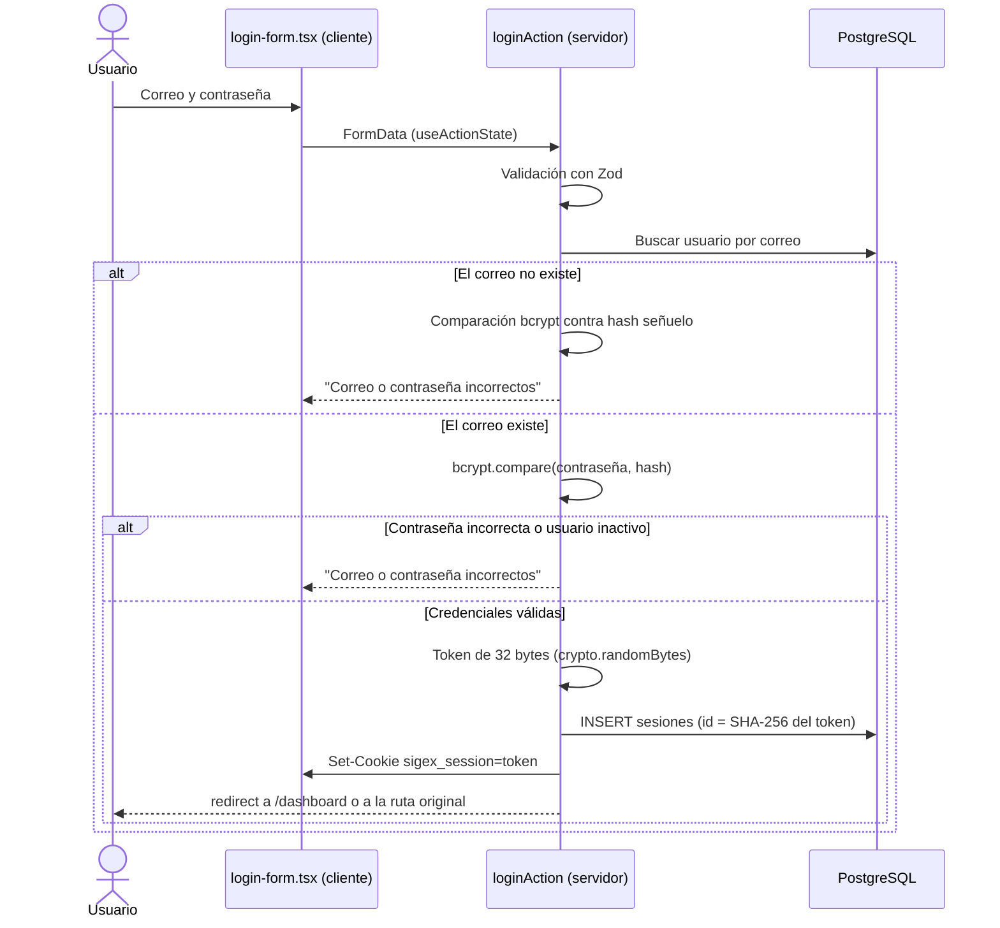
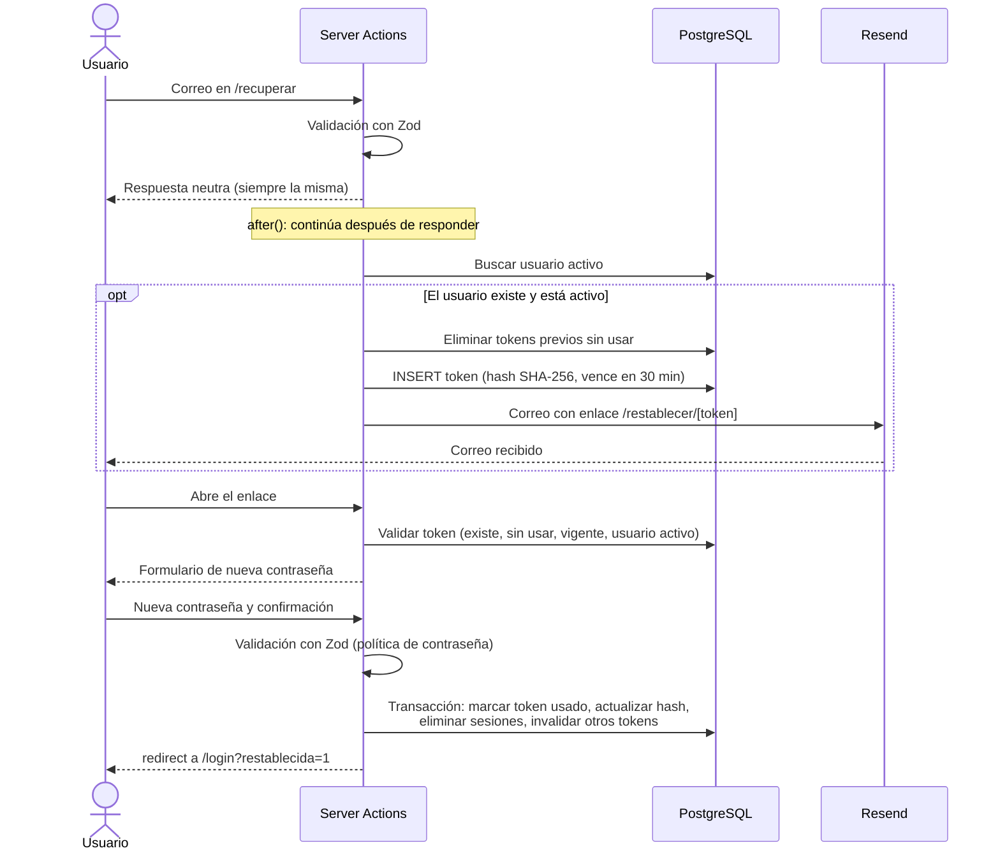
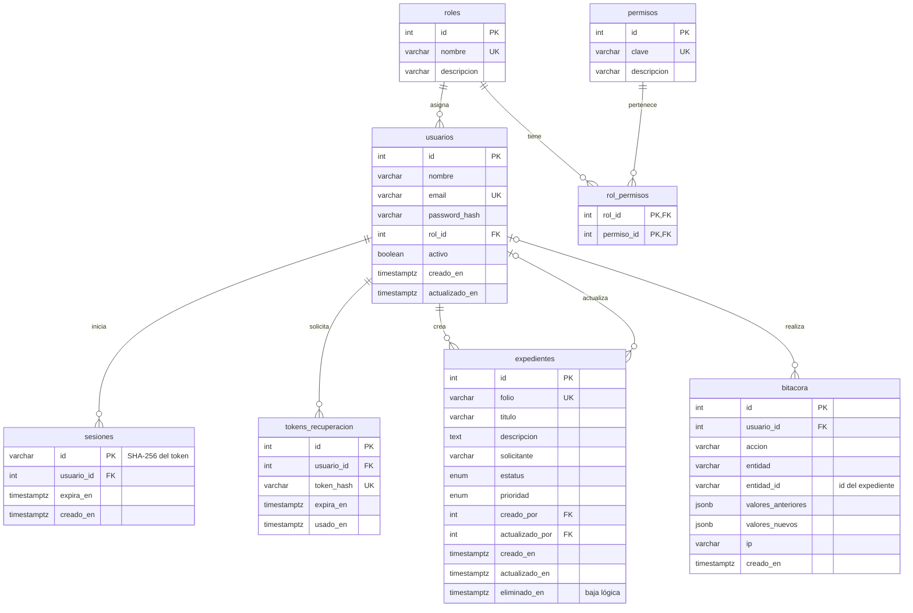

# Arquitectura de SIGEX

Este documento describe cómo está construido SIGEX: los componentes de la solución, la organización del código, los flujos de autenticación y recuperación de contraseña, el modelo de permisos, el modelo de datos y las decisiones técnicas tomadas durante el desarrollo, con sus ventajas, desventajas y limitaciones conocidas.

Las instrucciones de instalación y uso se encuentran en [README.md](./README.md).

## Tabla de contenido

1. [Vista general](#1-vista-general)
2. [Estructura de carpetas](#2-estructura-de-carpetas)
3. [Flujo de autenticación](#3-flujo-de-autenticación)
4. [Flujo de recuperación de contraseña](#4-flujo-de-recuperación-de-contraseña)
5. [Modelo de permisos](#5-modelo-de-permisos)
6. [Modelo de datos](#6-modelo-de-datos)
7. [Módulo de expedientes](#7-módulo-de-expedientes)
8. [Bitácora de auditoría](#8-bitácora-de-auditoría)
9. [Decisiones técnicas](#9-decisiones-técnicas)
10. [Resumen de seguridad](#10-resumen-de-seguridad)
11. [Limitaciones conocidas y mejoras](#11-limitaciones-conocidas-y-mejoras)

## 1. Vista general

SIGEX es una aplicación monolítica de Next.js. Un mismo proyecto contiene la interfaz, la lógica de negocio y el acceso a datos. La aplicación se comunica con dos servicios externos: PostgreSQL, alojado en Supabase, y Resend para el envío de correos.



Cada mecanismo del servidor tiene una responsabilidad definida:

| Mecanismo | Responsabilidad |
|---|---|
| `proxy.ts` | Filtrar cada navegación: redirigir a `/login` si no hay sesión y a `/no-autorizado` si falta el permiso de la ruta. |
| Server Components | Leer datos y renderizar páginas. Acceden a la base de datos directamente, sin pasar por la API. |
| Server Actions | Ejecutar todas las mutaciones: login, logout, recuperación de contraseña, expedientes y usuarios. |
| Route Handlers | Exponer consultas en JSON para los componentes del cliente que paginan y filtran sin recargar la página. |
| `lib/` | Concentrar la lógica reutilizable: sesiones, permisos, auditoría, correo y consultas. |

## 2. Estructura de carpetas

```
src/
├── proxy.ts
├── app/
│   ├── layout.tsx                  Layout raíz
│   ├── not-found.tsx               Página 404
│   ├── no-autorizado/page.tsx
│   ├── (auth)/                     Grupo de rutas públicas
│   │   ├── layout.tsx              Tarjeta de dos paneles
│   │   ├── login/page.tsx
│   │   ├── recuperar/page.tsx
│   │   └── restablecer/[token]/page.tsx
│   ├── (app)/                      Grupo de rutas protegidas
│   │   ├── layout.tsx              Sesión, menú por permisos y SessionProvider
│   │   ├── loading.tsx
│   │   ├── error.tsx
│   │   ├── dashboard/page.tsx
│   │   ├── expedientes/
│   │   │   ├── page.tsx
│   │   │   ├── nuevo/page.tsx
│   │   │   └── [id]/
│   │   │       ├── page.tsx
│   │   │       └── editar/page.tsx
│   │   └── admin/
│   │       ├── usuarios/...
│   │       └── bitacora/page.tsx
│   └── api/
│       ├── auth/me/route.ts
│       ├── expedientes/route.ts
│       └── bitacora/route.ts
├── actions/                        Server Actions por módulo
├── lib/                            Lógica de servidor y utilidades compartidas
│   └── validations/                Esquemas Zod
├── hooks/                          Hooks personalizados
├── components/
│   ├── ui/                         Componentes genéricos reutilizables
│   ├── auth/  expedientes/  usuarios/  bitacora/  layout/  providers/
├── emails/                         Plantillas de correo
└── types/                          Contratos de la API
```

### Grupos de rutas y layouts

Los paréntesis en `(auth)` y `(app)` crean grupos de rutas: organizan las páginas sin aparecer en la URL. Cada grupo tiene su propio layout porque las dos zonas del sistema tienen necesidades distintas:

- **`(auth)/layout.tsx`** presenta una tarjeta centrada para los formularios públicos. No consulta la sesión, ya que estas páginas deben funcionar sin ella.
- **`(app)/layout.tsx`** es un Server Component que obtiene la sesión con `requerirSesion()`, construye el menú lateral filtrado por permisos y envuelve el contenido en el `SessionProvider`. Todas las rutas protegidas heredan este comportamiento sin repetirlo.

Los archivos `loading.tsx` y `error.tsx` del grupo `(app)` se muestran dentro del layout: durante la carga o ante un error, el menú lateral permanece visible y solo cambia el área de contenido.

### Criterio de organización de `lib/`

Los archivos de `lib/` se dividen en dos categorías:

| Categoría | Archivos | Característica |
|---|---|---|
| Solo servidor | `session.ts`, `guards.ts`, `password.ts`, `password-reset.ts`, `tokens.ts`, `mail.ts`, `audit.ts`, `expedientes.ts`, `usuarios.ts`, `bitacora.ts` | Importan `server-only`. Si un Client Component los importa por error, el build falla. |
| Compartidos | `permissions.ts`, `navegacion.ts`, `catalogos.ts`, `formato.ts`, `validations/*` | No dependen de la base de datos, cookies ni APIs de Node. Pueden usarse en servidor y cliente. |

Esta separación permite, por ejemplo, que la función `can()` y los esquemas de Zod se usen en ambos entornos sin duplicar código.

## 3. Flujo de autenticación

La sesión se almacena en la tabla `sesiones`. El navegador conserva únicamente un token aleatorio en una cookie `httpOnly`.

### Inicio de sesión



Pasos de `loginAction` (`src/actions/auth.actions.ts`):

1. Valida el correo y la contraseña con `loginSchema`. El correo se normaliza a minúsculas y sin espacios.
2. Busca al usuario por correo.
3. Si el correo no existe, ejecuta `simularVerificacion`, una comparación bcrypt contra un hash señuelo. Así la respuesta tarda lo mismo que con un correo existente y no es posible deducir qué cuentas existen midiendo tiempos.
4. Verifica la contraseña antes de revisar si el usuario está activo, por la misma razón.
5. Responde con el mismo mensaje genérico para correo inexistente, contraseña incorrecta y usuario inactivo.
6. Si las credenciales son válidas, `crearSesion` genera el token, guarda su hash en la base de datos y escribe la cookie.
7. Redirige al destino indicado en el parámetro `from`, después de validar con `destinoSeguro` que sea una ruta interna. Esto evita redirecciones abiertas hacia sitios externos.

La cookie se configura con `httpOnly`, `secure` en producción, `sameSite=lax`, `path=/` y una expiración de 8 horas.

### Validación de la sesión en cada petición

`validarTokenSesion` (`src/lib/session.ts`) calcula el hash del token recibido y busca la sesión en una sola consulta que incluye al usuario, su rol y sus permisos. La sesión se considera inválida si no existe, si expiró o si el usuario está inactivo. En los dos últimos casos se elimina de la base de datos en ese momento (limpieza perezosa); si el usuario está inactivo, se eliminan todas sus sesiones.

`obtenerSesion` envuelve esta validación con `cache` de React, de modo que el layout, la página y los componentes de una misma petición comparten una sola consulta.

### Cierre de sesión

El botón de cierre de sesión es un formulario que invoca `logoutAction`. La acción llama a `destruirSesion`, que elimina el registro de la tabla `sesiones` y la cookie, y después redirige a `/login`.

Para impedir que el botón Atrás del navegador muestre páginas protegidas después del cierre de sesión, se aplican dos medidas:

- El proxy agrega `Cache-Control: private, no-store` a las respuestas de rutas protegidas, de modo que el navegador debe solicitarlas de nuevo al servidor, y el proxy redirige a `/login` al no encontrar sesión.
- El `SessionProvider` escucha el evento `pageshow`. Si el navegador restaura la página desde su caché de historial (`event.persisted`), la recarga para que el proxy vuelva a validar la sesión.

## 4. Flujo de recuperación de contraseña



### Solicitud

1. `solicitarRecuperacionAction` valida el formato del correo y responde de inmediato con un mensaje neutro: "Si el correo corresponde a una cuenta activa, recibirás un enlace". La respuesta es la misma exista o no la cuenta.
2. El trabajo real se programa con `after()` de Next.js, que se ejecuta después de enviar la respuesta. Consultar la base de datos y llamar a Resend toma varios cientos de milisegundos; si ocurriera antes de responder, la diferencia de tiempo revelaría qué correos están registrados.
3. `procesarSolicitudRecuperacion` (`src/lib/password-reset.ts`) busca al usuario. Si no existe o está inactivo, termina sin hacer nada.
4. Si existe, elimina los tokens anteriores sin usar, genera un token de 32 bytes con `crypto.randomBytes` y guarda su hash SHA-256 con un vencimiento de 30 minutos. El token en claro solo existe en el enlace del correo.
5. Construye el enlace con la variable `APP_URL`. No se usa el encabezado `Host` de la petición, ya que un cliente podría manipularlo para que el enlace apunte a un sitio falso.
6. `enviarCorreo` (`src/lib/mail.ts`) nunca lanza excepciones: devuelve `{ ok, error }`. Si Resend falla, el error se registra en la consola del servidor sin incluir el token.

### Restablecimiento

1. La página `/restablecer/[token]` valida el token al abrirse: formato correcto, existencia del hash, que no se haya usado, que no haya vencido y que el usuario esté activo. Si no es válido, muestra un mensaje en lugar del formulario. La página declara `referrer: "no-referrer"` para que el token no se filtre a otros sitios mediante el encabezado `Referer`.
2. `restablecerPasswordAction` valida la nueva contraseña con la política del sistema: mínimo 8 caracteres, al menos una letra y un número, y un máximo de 72 bytes, que es el límite que procesa bcrypt.
3. `restablecerPassword` calcula el nuevo hash fuera de la transacción, porque bcrypt es intencionalmente lento, y después ejecuta una transacción que:
   - Marca el token como usado con un `updateMany` condicionado a `usadoEn: null`. Si dos peticiones llegan al mismo tiempo, solo una actualiza la fila; la otra recibe "enlace no válido". Esto garantiza que el token sea de un solo uso incluso con peticiones concurrentes.
   - Actualiza el hash de la contraseña.
   - Elimina todas las sesiones del usuario.
   - Invalida cualquier otro token pendiente del usuario.
4. Redirige a `/login?restablecida=1`, donde se muestra un aviso de confirmación.

## 5. Modelo de permisos

### Diseño

Los permisos se asignan a roles mediante la tabla pivote `rol_permisos`, y los roles se asignan a usuarios. El código nunca compara el nombre del rol; siempre consulta permisos concretos con la función `can(usuario, permiso)`.

El catálogo mínimo del documento del proyecto se complementó con dos permisos:

| Permiso | Motivo |
|---|---|
| `expedientes:editar_todos` | El catálogo mínimo indica que el capturista edita solo sus expedientes, pero un único permiso `expedientes:editar` no permite distinguir entre editar propios y editar todos sin comparar el nombre del rol. Con este permiso, la regla se expresa así: se puede editar si se tiene `editar` y además `editar_todos` o ser el autor del expediente. |
| `expedientes:cambiar_estatus` | El supervisor debe poder cambiar el estatus y el capturista no, aunque ambos editan. Separar el permiso permite asignarlo de forma independiente. |

El catálogo se define una sola vez en `src/lib/permissions.ts` como constantes tipadas (`PERMISOS`). Un permiso mal escrito produce un error de TypeScript en lugar de un fallo silencioso.

### Dónde se valida

La autorización se verifica en varias capas. Solo las capas del servidor constituyen seguridad; las del cliente únicamente adaptan la interfaz.

| Capa | Archivo | Qué valida | Respuesta ante un fallo |
|---|---|---|---|
| Proxy | `src/proxy.ts` | Sesión y permiso general de la ruta (`permisoRequeridoParaRuta`) | Redirección a `/login` o `/no-autorizado` |
| Layout | `(app)/layout.tsx` | Sesión; filtra el menú con `construirMenu` | Redirección a `/login` |
| Página | `requerirPermiso` en cada `page.tsx` | Permiso de la página y reglas que dependen del registro, como editar propios | Redirección a `/no-autorizado` o 404 |
| Server Action | `verificarAcceso` en cada acción | Sesión, permiso y reglas del registro dentro de la transacción | Mensaje de error en el formulario |
| Route Handler | `verificarAcceso` en cada endpoint | Sesión y permiso | 401 o 403 en JSON |
| Componente | `<Can>`, `usePermission`, `can()` | Mostrar u ocultar botones y controles | El elemento no se renderiza |

`src/lib/guards.ts` ofrece dos estilos de verificación según quién la utiliza:

- **`requerirSesion` y `requerirPermiso`** redirigen. Se usan en páginas y layouts.
- **`verificarAcceso`** devuelve `{ ok, sesion }` o `{ ok: false, status, mensaje }`. Se usa en Server Actions, que deben devolver el error al formulario, y en Route Handlers, que deben responder con un código HTTP.

### Ejemplo: la regla de edición de expedientes

La regla "el capturista solo edita sus propios expedientes" se aplica en cuatro puntos:

1. **Proxy:** verifica `expedientes:editar` para `/expedientes/[id]/editar`. No puede comprobar la autoría porque no consulta el expediente.
2. **Página de edición:** consulta el expediente y aplica `puedeEditarExpediente`. Si un capturista escribe la URL de un expediente ajeno, es redirigido a `/no-autorizado`.
3. **`editarExpedienteAction`:** vuelve a aplicar la regla dentro de la transacción, con el registro leído en ese momento. Es la barrera definitiva.
4. **Listado y detalle:** muestran el botón "Editar" solo cuando la regla se cumple.

### Permisos en el cliente

El `SessionProvider` recibe el usuario desde el layout del servidor y lo expone mediante un contexto de React. Sobre él se construyen tres herramientas con usos distintos:

| Herramienta | Tipo | Uso |
|---|---|---|
| `can(usuario, permiso)` | Función pura | Servidor y cliente. En el servidor se usa directamente con la sesión. |
| `usePermission(permiso)` | Hook | Client Components que necesitan el permiso como valor booleano dentro de la lógica. |
| `<Can permiso={...}>` | Componente | Client Components que solo necesitan mostrar u ocultar un bloque de JSX. |

El proveedor también consulta `GET /api/auth/me` cuando el usuario regresa a la pestaña. Si la sesión venció, redirige a `/login`; si los permisos cambiaron, solicita al servidor que vuelva a renderizar el layout para actualizar el menú.

## 6. Modelo de datos



### Notas sobre el modelo

- **`rol_permisos`** usa una llave primaria compuesta (`rol_id`, `permiso_id`), lo que impide asignar dos veces el mismo permiso a un rol.
- **`sesiones.id`** no es un valor autoincremental: es el hash SHA-256 del token de la cookie. Si la tabla se filtrara, sus valores no permitirían suplantar a ningún usuario.
- **`tokens_recuperacion.token_hash`** sigue el mismo principio: el token en claro nunca se almacena.
- **`expedientes.eliminado_en`** implementa la baja lógica. Un valor nulo indica un expediente activo; una fecha indica la baja y cuándo ocurrió. El registro nunca se elimina físicamente.
- **`bitacora.entidad_id`** guarda el id del expediente como texto y no es una llave foránea. La relación es lógica: la bitácora conserva su información aunque el expediente cambie, y la columna `entidad` permitiría auditar otras entidades sin modificar la tabla.
- **Llaves foráneas hacia `usuarios`** usan `onDelete: Restrict` en expedientes y bitácora. Un usuario con historial no puede eliminarse; el sistema contempla su desactivación, que conserva la integridad del historial.
- **Índices:** además de las llaves únicas, existen índices sobre `expedientes.estatus`, `expedientes.prioridad`, `expedientes.eliminado_en`, `expedientes.creado_por`, `bitacora.creado_en`, el par `bitacora.entidad` y `bitacora.entidad_id`, y `sesiones.expira_en`, que corresponden a los filtros de los listados.
- **Tipos de fecha:** todas las columnas de fecha usan `timestamptz`, que almacena el instante en UTC. La conversión a la hora de México se realiza al presentar los datos.

## 7. Módulo de expedientes

### Listado

La página `/expedientes` combina un Server Component y un Client Component:

1. **`expedientes/page.tsx`** (servidor) valida el permiso, lee los filtros iniciales de la URL y renderiza el encabezado.
2. **`ExpedientesListado`** (cliente) mantiene el estado de los filtros y muestra la tabla.
3. **`useExpedientes`** consulta `GET /api/expedientes` cada vez que cambian los filtros.

Características del listado:

- **`useDebounce`** espera 350 ms después de la última tecla antes de consultar, en lugar de enviar una petición por cada carácter.
- **`AbortController`** cancela la petición anterior si los filtros cambian antes de que llegue la respuesta, de modo que nunca se pinta un resultado desactualizado.
- **Datos conservados durante la carga:** la tabla mantiene los datos anteriores con menor opacidad en lugar de vaciarse.
- **Sincronización con la URL:** los filtros se reflejan en la URL con `window.history.replaceState`, sin provocar una navegación. Esto permite recargar la página, compartir la vista y enlazar desde el panel con filtros aplicados (`?estatus=abierto`).
- **Reinicio de la paginación:** cuando cambia un filtro, la página vuelve a 1. La página actual se guarda junto con la combinación de filtros a la que pertenece; si esa combinación deja de ser la vigente, la página efectiva es 1. Esto evita efectos adicionales y renderizados innecesarios.
- **Filtro de expedientes propios:** el cliente envía únicamente la intención (`mios=1`). El Route Handler obtiene el id del usuario desde la sesión y lo pasa a la consulta. El identificador del usuario nunca proviene de un parámetro enviado por el cliente.

### Folio

El folio tiene el formato `EXP-AAAA-NNNNNN`, por ejemplo `EXP-2026-000031`, donde el número es el id del registro. El alta se realiza dentro de una transacción:

1. Se inserta el expediente con un folio provisional aleatorio, necesario porque la columna es obligatoria y única.
2. Se obtiene el id asignado por PostgreSQL.
3. Se actualiza el folio con su valor definitivo.

Como el id es único y lo asigna la base de datos, dos altas simultáneas nunca generan el mismo folio, sin necesidad de tablas de contadores ni bloqueos. El folio provisional nunca es visible fuera de la transacción. El año se calcula con la zona horaria de la Ciudad de México.

### Mutaciones

Todas las acciones de `src/actions/expedientes.actions.ts` siguen el mismo orden:

1. Verificar sesión y permiso con `verificarAcceso`.
2. Validar la entrada con Zod.
3. Leer el registro, aplicar las reglas de negocio, modificarlo y registrar la bitácora en una sola transacción.
4. Llamar a `revalidatePath` para las rutas afectadas: listado, detalle y panel.

| Acción | Invocación desde el cliente | Detalle |
|---|---|---|
| `crearExpedienteAction` | `useActionState` en un formulario | Asigna el folio y redirige al detalle. |
| `editarExpedienteAction` | `useActionState`; el id se fija con `.bind(null, id)` | Si no hay cambios reales, no escribe ni audita. |
| `cambiarEstatusAction` | `useActionState`; el id viaja en un campo oculto | Solo para quien tiene `expedientes:cambiar_estatus`. |
| `eliminarExpedienteAction` | `useTransition`, como llamada directa | Permite ejecutar código después de terminar: recargar el listado o navegar. |

En todos los casos, el id recibido se valida de nuevo en el servidor, ya que cualquier valor proveniente del cliente puede manipularse.

### Baja lógica

La baja asigna una fecha a `eliminado_en`. Todas las consultas de expedientes filtran `eliminadoEn: null`: el listado, la API, el detalle, la edición, el panel y las acciones. Un expediente dado de baja deja de mostrarse en todo el sistema, pero permanece en la base de datos y sigue visible en la bitácora, marcado como dado de baja.

## 8. Bitácora de auditoría

### Alcance

De acuerdo con el documento del proyecto, la bitácora registra cada creación, edición, cambio de estatus y baja de un expediente. La administración de usuarios y los eventos de autenticación no se auditan, para ajustarse al alcance solicitado.

### Registro

`src/lib/audit.ts` concentra la escritura:

- **`instantanea(registro, campos)`** extrae los campos auditados de un registro y convierte las fechas a texto ISO. Descarta siempre campos sensibles como `passwordHash` o `tokenHash`, aunque se soliciten.
- **`calcularCambios(antes, despues)`** devuelve únicamente los campos que cambiaron. Si no cambió ninguno, devuelve `null` y la edición no se registra.
- **`registrarBitacora(entrada, tx)`** inserta el registro. Recibe el cliente de la transacción, de modo que el cambio y su registro se confirman juntos o se revierten juntos. No puede existir un cambio sin auditar ni un registro de un cambio que no ocurrió.

| Acción | `valores_anteriores` | `valores_nuevos` |
|---|---|---|
| `crear` | Nulo | Todos los campos auditados, incluido el folio definitivo |
| `editar` | Solo los campos modificados | Solo los campos modificados |
| `cambiar_estatus` | `{ estatus }` | `{ estatus }` |
| `eliminar` | El expediente completo | `{ eliminadoEn }` |

En la baja se conserva el expediente completo para dejar constancia exacta de lo que se dio de baja. La dirección IP se obtiene del encabezado `x-forwarded-for`, que es por donde llega la IP del cliente cuando la aplicación opera detrás de Vercel u otro proxy.

### Protección de solo inserción

La bitácora está protegida en tres niveles:

1. **Aplicación:** `audit.ts` solo expone funciones de inserción y `lib/bitacora.ts` solo expone consultas de lectura.
2. **Interfaz:** ninguna pantalla ofrece editar o eliminar registros.
3. **Base de datos:** la migración `bitacora_solo_insercion` crea un trigger que rechaza cualquier `UPDATE`, `DELETE` o `TRUNCATE` sobre la tabla, sin importar el origen de la operación.

### Consulta

La página `/admin/bitacora` sigue el mismo patrón que el listado de expedientes: un Client Component que consume `GET /api/bitacora` mediante `useBitacora`, construido sobre el hook genérico `useConsultaApi`. Los filtros son usuario, acción, rango de fechas y expediente.

- **Fechas:** los filtros representan días del calendario de México. El rango se convierte a UTC con un desfase fijo de -06:00, ya que la Ciudad de México no aplica horario de verano desde 2022. Un filtro "hasta el 8 de octubre" incluye hasta las 23:59 de ese día en hora de México.
- **Expediente:** como la bitácora guarda el id y no el folio, la consulta se realiza en dos pasos: primero se buscan los expedientes cuyo folio coincide, incluidos los dados de baja, y después sus registros.
- **Presentación:** los folios de cada página se resuelven en una sola consulta. Los valores se traducen a etiquetas legibles: estatus, prioridad y fechas.

## 9. Decisiones técnicas

### Server Components y Client Components

El criterio es que un componente es de servidor por defecto y se convierte en cliente solo cuando necesita interactividad, hooks o APIs del navegador.

| Server Components | Motivo |
|---|---|
| Páginas y layouts | Validan la sesión y los permisos, y leen datos directamente de la base de datos. No envían ese código al navegador. |
| `LogoutButton` | El formulario invoca la Server Action sin necesidad de JavaScript propio. |
| `CampoFormulario`, `Alerta`, `Insignia` y otros componentes de presentación | No tienen estado ni eventos. Pueden usarse desde ambos entornos. |

| Client Components | Motivo |
|---|---|
| Formularios (`LoginForm`, `ExpedienteForm`, `UsuarioForm`...) | Usan `useActionState` para mostrar errores sin recargar la página. |
| `SubmitButton` | Usa `useFormStatus` para mostrar el estado de envío. |
| `ExpedientesListado`, `BitacoraListado` | Mantienen el estado de los filtros y consultan la API. |
| `Sidebar` | Necesita la ruta actual (`usePathname`) y el estado del panel móvil. |
| `SessionProvider`, `<Can>` | Usan el contexto de React. |
| `BotonEliminarExpediente`, `BotonEstadoUsuario` | Tienen confirmación en línea con estado local. |

Los Client Components se mantienen pequeños y se insertan dentro de páginas de servidor. Por ejemplo, la página de login es un Server Component que verifica si ya existe una sesión y solo el formulario es interactivo.

**Ventajas:** menos JavaScript enviado al navegador, acceso directo a datos sin endpoints intermedios y lógica sensible que nunca sale del servidor.
**Desventajas:** la frontera entre ambos entornos exige cuidado. Un Client Component no puede importar módulos de servidor, y las props que cruzan la frontera deben ser serializables. Para reducir errores, los módulos de servidor importan `server-only`.

### Server Actions y Route Handlers

| Mecanismo | Uso en SIGEX | Motivo |
|---|---|---|
| Server Actions | Login, logout, recuperación de contraseña, CRUD de expedientes, cambio de estatus y administración de usuarios | Son mutaciones originadas en formularios. Se integran con `useActionState` y `useFormStatus`, funcionan sin JavaScript en el cliente, permiten `revalidatePath` y `redirect`, y Next.js genera el endpoint y la protección contra CSRF de forma automática. |
| Route Handlers | `GET /api/expedientes`, `GET /api/bitacora`, `GET /api/auth/me` | Son consultas de solo lectura que el cliente repite con distintos parámetros. Devuelven JSON con códigos HTTP explícitos (200, 400, 401, 403, 500) y pueden consumirse desde un hook o desde cualquier otro cliente HTTP. |

Las páginas del servidor no consumen los Route Handlers: consultan la base de datos directamente mediante las funciones de `lib/`. Los Route Handlers existen para el cliente. Ambos caminos reutilizan las mismas funciones de consulta, como `listarExpedientes`.

**Ventajas de esta división:** cada mecanismo se usa donde es más fuerte y la lógica de negocio no se duplica.
**Desventajas:** existen dos puntos de entrada al servidor que deben protegerse por separado. Por eso cada acción y cada endpoint llama a `verificarAcceso` de forma independiente.

### Sesión en base de datos o JWT

Se eligió **sesión en base de datos**.

El documento del proyecto exige tres comportamientos que requieren revocar una sesión desde el servidor en cualquier momento:

- El cierre de sesión debe invalidar la sesión en el servidor.
- El cambio de contraseña debe invalidar las sesiones activas.
- La desactivación de un usuario debe invalidar sus sesiones vigentes.

Con sesiones en base de datos, cada uno de estos casos se resuelve con un `DELETE`. Un JWT firmado, en cambio, es válido hasta su expiración y no puede revocarse sin mantener una lista de revocación consultada en cada petición, lo que elimina su principal ventaja: no depender de la base de datos.

| Criterio | Sesión en base de datos | JWT |
|---|---|---|
| Revocación inmediata | Un `DELETE` | Requiere lista de revocación |
| Cambios de permisos | Se aplican en la siguiente petición | Quedan desactualizados hasta que el token expira, si se incluyen en él |
| Consulta por petición | Sí | No, salvo que exista revocación |
| Escalamiento horizontal o en el edge | Depende de la base de datos | Es su punto fuerte |
| Complejidad | Baja | Media o alta para hacerlo de forma correcta |

**Ventajas:** revocación inmediata, permisos siempre actualizados e implementación sencilla.
**Desventajas:** una consulta a la base de datos por petición. En un sistema interno con una sola base de datos, este costo es aceptable.

En Next.js 16, `proxy.ts` se ejecuta en el runtime de Node.js, lo que permite consultar la base de datos con Prisma desde el proxy. Esto hace posible redirigir a `/no-autorizado` según los permisos vigentes del usuario.

### ORM: Prisma

Se eligió Prisma 6 en lugar de Drizzle.

**Ventajas:**

- El schema declarativo funciona como documentación del modelo de datos.
- Genera tipos de TypeScript a partir del schema, de modo que un campo inexistente produce un error de compilación.
- Las migraciones se generan y versionan con un solo comando.
- Las consultas se parametrizan siempre, por lo que no existe SQL construido por concatenación.

**Desventajas:**

- Requiere un paso de generación del cliente (`prisma generate`), resuelto con el script `postinstall`.
- No representa triggers ni otras características específicas de PostgreSQL; el trigger de la bitácora se escribió como migración manual.
- Su capa de abstracción es más gruesa que la de Drizzle, que se acerca más al SQL.

### Validación con Zod

Los esquemas viven en `src/lib/validations/` y no dependen del servidor, por lo que pueden usarse en ambos entornos. El servidor siempre valida, sin importar lo que haya validado el cliente. Los formularios usan `noValidate` para que los mensajes de error provengan de Zod y sean consistentes entre navegadores.

Los esquemas de filtros de los listados se reutilizan en dos lugares: en la página, para leer los filtros iniciales de la URL, y en el Route Handler, para validar los parámetros de la API.

### Hooks personalizados

| Hook | Responsabilidad |
|---|---|
| `useSession` | Acceso al usuario de la sesión y a la función `refrescar`. |
| `usePermission` | Verificación de un permiso como valor booleano. |
| `useConsultaApi` | Consulta genérica de un endpoint GET: cancelación de peticiones, conservación de datos durante la carga y redirección ante un 401. |
| `useExpedientes` | Consulta del listado de expedientes. |
| `useBitacora` | Consulta de la bitácora, construida sobre `useConsultaApi`. |
| `useDebounce` | Retraso de un valor hasta que deja de cambiar. |

Además, se utilizan los hooks de React `useActionState` (estado y errores de formularios), `useFormStatus` (estado de envío en `SubmitButton`) y `useTransition` (baja de expedientes).

## 10. Resumen de seguridad

| Requisito | Implementación |
|---|---|
| Cookie de sesión | `httpOnly`, `secure` en producción, `sameSite=lax`, `path=/`, expiración de 8 horas |
| Contraseñas | bcrypt con costo 12; política de mínimo 8 caracteres, al menos una letra y un número |
| Token de recuperación | `crypto.randomBytes(32)`, almacenado como hash SHA-256, de un solo uso incluso con peticiones concurrentes, vigencia de 30 minutos |
| Enumeración de usuarios | Mensajes genéricos, tiempos de respuesta equivalentes en el login y trabajo diferido con `after()` en la recuperación |
| Protección de rutas | Proxy como primera barrera y validación independiente en páginas, acciones y endpoints |
| Validación de entrada | Zod en el servidor para todos los datos; consultas parametrizadas mediante Prisma |
| Secretos | Solo en variables de entorno de servidor, sin prefijo `NEXT_PUBLIC_`; módulos de servidor protegidos con `server-only` |
| Usuarios desactivados | No pueden iniciar sesión; sus sesiones se eliminan al desactivarlos y se rechazan en cada validación |
| Redirecciones | El parámetro `from` del login solo acepta rutas internas |
| Enlaces de correo | Construidos con `APP_URL`, no con el encabezado `Host` |
| Caché del navegador | `Cache-Control: no-store` en rutas protegidas y recarga ante restauración desde el historial |
| Errores | Los mensajes al usuario nunca exponen detalles técnicos; el detalle se registra en el servidor. El proxy niega el acceso si la base de datos no responde. |
| Autoprotección del administrador | Un administrador no puede desactivarse ni cambiar su propio rol |

